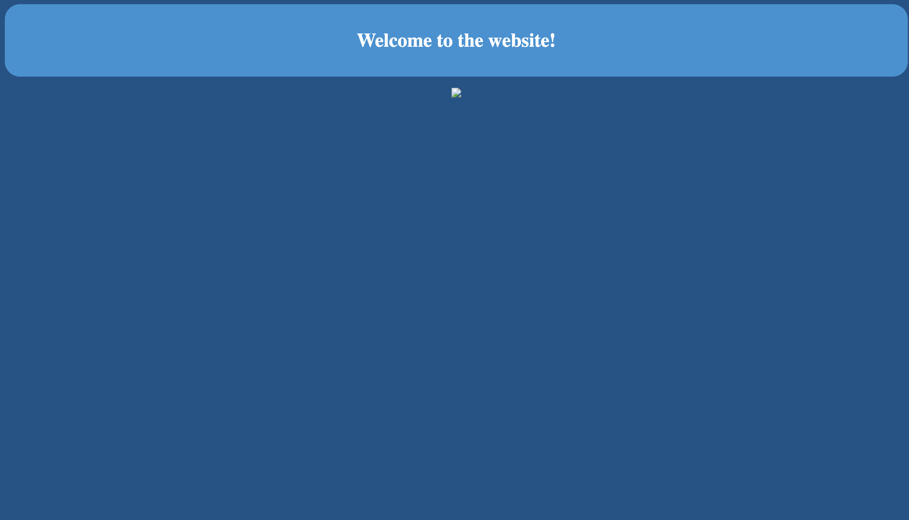

# Docs: Instruction to start leaky image project
Here is the instruction to run the project

## VM Related 
### password
the virtual machine have a username and a password
```json
{
    username: yoghurt,
    password: password,
}
```
the vm might sleep after idling sometime, use password `password` to access the vm again
### Performance
As this attack related to web browser, it is recommended to set the RAM to **4096MB** for better performance. Also, starting the server is quite slow when we test it in the VM, please be patient as it takes about 1 mins to start all of three servers we need.

## Prerequisites
We need to install several executables and make them available from the command line as follows
* Go (>1.16)
* node.js (latest version)
* npm (latest version)

Notice that these executables are pre-installed in the VM, but it is required if you run it on your local machine.

## File structures
To run the project we need to create a file structure as follows (VM have set this up already at "Desktop")
```
- leaky-image-project
|-- image-api
|-- image-website
|-- attacker-website
|-- example.png
|-- start.sh
```
where `image-api` is the server for the authenticated image upload server, `image-website` is the UI for the upload image upload service, and `attacker-website` is attacker controlled website that victims would visit.

We create a bash script to start the server concurrently called `start.sh` which is in this directory. We also provide an example image called `example.png` that we used in the serive, and this image have already been uploaded to the image sharing service via api.
## Install dependencies
This step would be skipped in the virtual box as it is pre-installed by us (as no access to the internet)
* For `image-api` we need to run `go get` 
* For `image-website` we need to run `npm install`
* For `attacker-website` we need to run `npm install`

## Start the service
We need to navigate to the root of `leaky-image-project` directory in terminal like following
```
$ pwd
$ /Desktop/leaky-image-project
```
and execute the script
```
sh start.sh
```
**N.B**: we have to make sure following ports are available, `localhost:3000`, `localhost:3030`, `localhost:8080`.

Notice that it might be very slow, please be patient and wait until following display in the terminal.
<p align="center">
    
</p>

It will automatically prompt us to a website running on localhost:3000, if not just open the default browser and navigate to localhost:3000

## Experiment
There are 3 available login credentials
```json
{
    {
        Name:     "attacker",
        Password: "attackPass",
    },
    {
        Name:     "victim0",
        Password: "victim0Pass",
    },
    {
        Name:     "victim1",
        Password: "victim1Pass",
    },
},
```

There is one image already uploaded to the server in the VM, but we could still upload our own by logging in to the attacker's account.
<p align="center">
    
</p>
After a successful login, we could see this image and the cookie is set for us to store the login token.

On this page, we could select a image file, we have provided an example image in the directory in the VM. If you would like to upload other image to test it, notice that the server only accept `png`, `jpeg` and `jpg` files.

If we upload file successfully, we could see the file address on the server.
<p align="center">
    
</p>

In the experiment we ignore the step for sharing the image address with the victim for simplicity reasons, instead we directly copy the image address in the attacker-controlled website html code
<p align="center">
    
</p>
We change line 2 to what we have shared with the victim. (Note: the original url is our test file address, do not need to change if you use the test file [example.png])

Then we could open a new tab in the browser at localhost:8080 to open the attacker controlled website, we can see the image appears.
<p align="center">
    
</p>

To test the case when victim do not login, we need to logout the image upload service. by clicking `Logout`
<p align="center">
    
</p>

Going back to the attacker-controlled website at localhost:8080, and refreshing it we could notice that the image would not appear
<p align="center">
    
</p>

If we login using the victim credential in the image upload service website at localhost:3000, and go back to the attacker-controlled website at localhost:8080. After refreshing the website, we could see the image presented properly.
<p align="center">
    
</p>

Also, we could observe the content of the log by 
```
cat attacker-website/victimlog.txt
```
We could see
```
$ cat attacker-website/victimlog.txt
$ The targeted victim visited on : Fri Mar 11 2022 16:05:24 GMT+0000 (Greenwich Mean Time)
```
